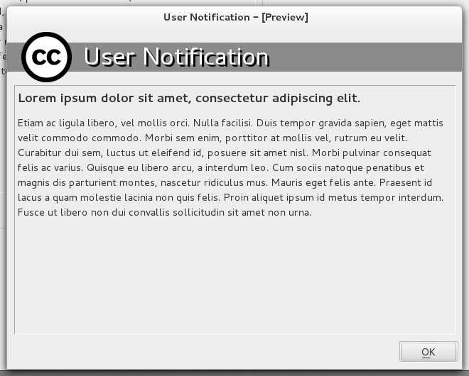

Pasuuna-notification-system
===========================

Pasuuna notification system is a corporate environment support tool. It aims to serve end users notifications about the status of the services - especially in major incident situations.

The design principles:

* No dependencies to other systems (eg. email, instant messaging, and support portal)
* Can be set up using minimal resources, and independent of centralized hosting solution
* Cross platform (built using QT)
* Dead simple to administer
* K.I.S.S.
* Simple HTML formatting is supported for the notifications

Screenshot
----------

Working principle
-----------------

The provided application is CLIENT only. The SERVER can be any web server that supports TLS/SSL, and can serve static file sufficiently fast. Apache and Nginx are probably most common choices.

1. The provided application is just a HTTP client that sits at background of user session
1. The client checks the provided URL at defined intervals for updates
 *  The certificate of the server will be checked to thwart spoofing
1. When the content changes, it will be shown to end users with a popup
1. The applications continues sitting on the background after the first popup

Setup
-----

Setting the system up is easy:

1. Compile the provided application (QT toolchain will do that for you with a single click)
1. Configure the application using the provided ini file (example values are provided)
 * Make sure to provide the whole certificate chain, and not just the server certificate
1. Roll-out the application - this depends on your environment (MSI and SCCM/AD for Windows, RPM/Satellite for RedHat & co, and so on)
 * Provide your company logo, certificate chain, and configuration file with the package
1. Set up a web server that is extremely reliable, and has preferably very little dependencies to the rest of your IT infrastructure
1. In major incidents inform your end users about the situation by putting the notifications on the server you built. 

Limitations
-----------

The application is very simple. It is supposed to be to ensure there are no breaking parts. 

The first relevant limitation that comes to mind is probably that the URLs in your messages are not clickable. That would be possible to provide if deemed necessary.
